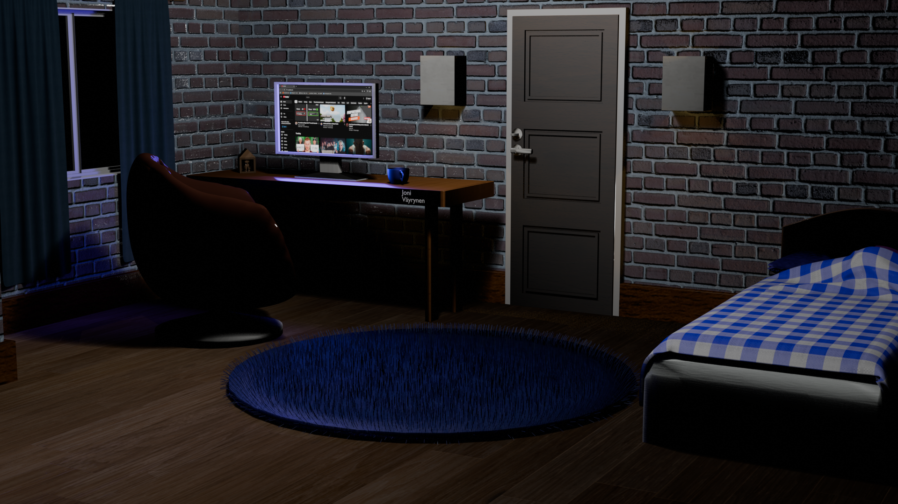

# 3D Room Interior (Blender)

  

This repository showcases a 3D interior room scene modeled in **Blender** as part of a university course project.

## Overview
- Complete interior room layout modeled in Blender
- Focus on proportions, spatial layout, and basic material setup
- Scene rendered in Blender (lighting and materials)
- Interactive real-time version available on Sketchfab

## Interactive 3D View
🔗 **Sketchfab:** https://sketchfab.com/3d-models/first-3d-room-bf06e4e659ab4af090564f42376e0a80

> Note: Lighting differs in Sketchfab due to real-time WebGL rendering compared to Blender.

## Tools Used
- Blender
- Basic PBR materials
- Real-time export for Sketchfab

This project is included as an additional portfolio piece to demonstrate basic 3D modeling and spatial design skills.
